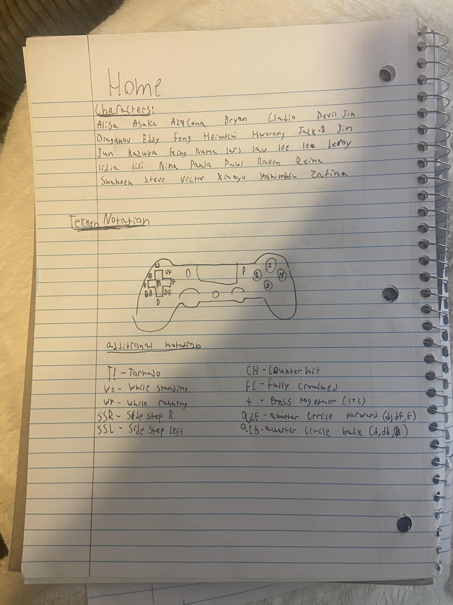

# startup
startup application for CS 260

[Notes](notes.md)

## Specification Deliverable

### Elevator pitch

Tekken is one of the most difficult fighting games to learn. Each of the 30+ characters have more than 100 different moves, some even having 200. For a new player this amount of moves can be incredibly overwelming. This is where the Tekken Database comes in. On this website there will be gifs of the most important moves from each character and how to beat them. Users can login, select the character they are having trouble beating and learn their most common moves. Users can also add matchup specific advice for the character they play. Its the one stop shop for learning how to beat any character in Tekken 8.

### Design

### Technologies

I am going to use the required technologies in the following ways.

- **HTML** - There will be several HTML pages, one for each character and a home page. Each page will have a few gifs of the characters most important moves.
- **CSS** - I will use this application to style the website and make it look good.
- **React** - Provides login, choice display, applying user matchup advice, and use of React for routing and components.
- **Service** - Backend service with endpoints for:
  - login
  - submitting matchup advice
- **DB/Login** - Store users and matchup advice in database. Register and login users. Can't add matchup advice unless authenticated.
- **WebSocket** - As each user adds matchup advice, it will broadcast it all users.
